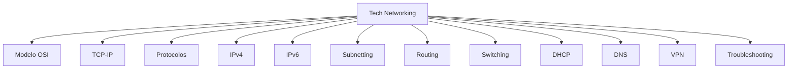

# Tech Networking

Esta área cobre os fundamentos de Redes de Computadores: modelos conceituais, protocolos, endereçamento IP, roteamento, switching, serviços de infraestrutura (DHCP, DNS), segurança de conectividade (VPN) e diagnóstico de problemas. O objetivo é construir uma base sólida que sustente tanto certificações quanto o dia a dia de operação e troubleshooting de redes.

## Mapa mental

## Tópicos

| Tópico | Descrição |
|---|---|
| [Modelo_OSI.md](Modelo_OSI.md) | Modelo de referência em 7 camadas para descrever a comunicação de rede. |
| [TCP-IP.md](TCP-IP.md) | Pilha de protocolos prática (4 camadas) que sustenta a internet e as redes atuais. |
| [Protocolos.md](Protocolos.md) | Visão geral dos principais protocolos de aplicação e infraestrutura (HTTP, SSH, ICMP, ARP, etc). |
| [IPv4.md](IPv4.md) | Endereçamento IP de 32 bits, classes, CIDR, NAT e faixas privadas. |
| [IPv6.md](IPv6.md) | Endereçamento IP de 128 bits, SLAAC, NDP e o fim da necessidade de NAT. |
| [Subnetting.md](Subnetting.md) | Divisão de redes IP em sub-redes menores usando máscaras e CIDR. |
| [Routing.md](Routing.md) | Encaminhamento de pacotes entre redes, rotas estáticas e dinâmicas, tabelas de roteamento. |
| [Switching.md](Switching.md) | Encaminhamento de quadros dentro de uma LAN, VLANs, trunks e Spanning Tree. |
| [DHCP.md](DHCP.md) | Atribuição automática de configurações de rede a dispositivos clientes. |
| [DNS.md](DNS.md) | Sistema de resolução de nomes de domínio para endereços IP. |
| [VPN.md](VPN.md) | Túneis criptografados para acesso remoto seguro e interconexão de redes. |
| [Troubleshooting.md](Troubleshooting.md) | Método estruturado para diagnosticar e resolver problemas de rede. |
